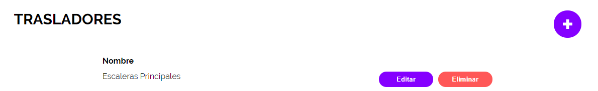
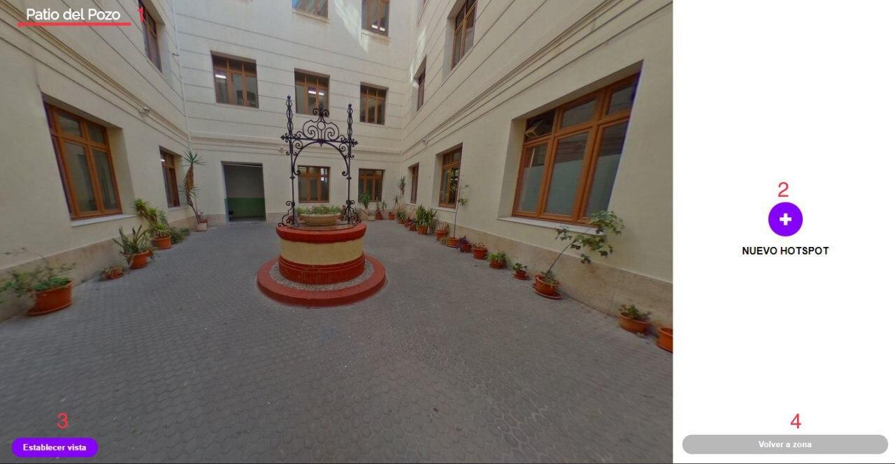

# **¿Qué es Celia 360?** 
El Celia 360, o más conocido como Celia Tour, es una aplicación web creada por el alumnado del 2º curso del Ciclo Formativo de Desarrollo de Aplicaciones Web (DAW) del I.E.S Celia Viñas de Almería, durante el año académico 2019/2020. 
Este trabajo fue realizado con la ayuda y supervisión de los siguientes profesores: 

* Félix Expósito López
* Alfredo Moreno Vozmediano
* Manuel Cristóbal Piñero Mendoza

Fue desarrollado por los siguientes alumnos: 

* Jose Francisco Bousfanj Muñoz
* Alejandro Clares Muñoz 
* Rosendo De Quero Granados 
* María del Mar Fernández Bonillo
* Ángel Salas Calvo
* Carmen María Soriano Tortosa

Además obtuvimos ayuda y colaboración de las siguientes personas: 

* Antonio Barrera Funes
* María del Carmen Cuadrado Sánchez
* María Belén Garzón
* Trinidad Gómez Ruiz
* María José Hernández Meca
* José Luis Hurtado
* Carmen Menéndez Suárez
* Juan González Parra
* Salvador Prieto Pérez
* Luis Serrano Cortés
* Manuela Soriano Sánchez

Esta aplicación fue diseñada para crear recorridos virtuales a través de fotografías panorámicas (Imágenes 360º). 

Nuestra aplicación permite definir las zonas en las que se basará el recorrido virtual, y dentro de cada zona asignar las escenas necesarias a través de puntos situadas en el mapa. A través de estos puntos en el mapa podemos conectar unas escenas con otras para crear el recorrido final. También nos permite crear puntos de interés (hostpots) en cualquier escena, permitiendo así al usuario interactuar con el recorrido. Más adelante veremos más en profundidad que son los hostpots y que tipo existen. 
En definitiva lo único que necesitamos para poder montar nuestro Tour Virtual a través de nuestra aplicación web es simplemente, imágenes con los mapas de la estancia en la que vamos a hacer el recorrido, imágenes 360 de las estancias del recorrido y en caso de querer meter información adicional necesitaremos imágenes, audios o videos para los hostpot de la información adicional. 

# **Guía de instalación:**

# **Primeros pasos:** 

Una vez instalada nuestra aplicación podremos usarla desde dos perspectivas diferentes: 

1. **Visita virtual:**  Esta es la parte que usara los visitantes de nuestra aplicación, proporciona acceso a los tres modos de las visitas que hemos creado, la visita libre, la visita guiada y los puntos destacados. 
2. **Panes del administración:** Esta parte de la aplicación solo puede ser vista por los usuarios administradores y nos permitirá configurar y crear nuestro tour virtual a partir de las distintas opciones de su menú. 

Como hemos mencionado anteriormente nuestra aplicación final contará con tres modos diferentes de acceso: 

* **Visita libre:** Permite al usuario moverse por el tour virtual con libertad 
* **Visita guiada:** Hace un recorrido por las parte más relevantes del tour virtual, y a su vez va dando una explicación del recorrido que se esta llevando a cabo a través de audios. 
* **Puntos destacados:** Muestra una selección de los puntos más importantes del recorrido y nos permite acceder directamente a las escenas que lo componen. 

## **Visita Virtual:**

Como podemos observar en la foto en la página principal tenemos los botones para acceder a los diferentes modos de la aplicación, además de las páginas de crédicos, aviso legal y politica de cookies en la parte inferior derecha. 
También será posible agregar la opción de que en esa misma esquina aparezca el botón de *Historia* que nos permitirá escribir un resumen de la historia del recorrido que vamos a ver a continuación. 

## **Panel de administración:** 

Como podemos observar el panel de administración se compone de 9 componentes que nos permitiran configurar y crear nuestro tour virtual. Estos apartados serán explicados más detalladamente más adelante pero antes de empezar a configurarlo le aconsejamos que previamente realice las siguientes funciones: 

1. Haga planos digitalizados y detallados del lugar que pretende virtualizar
2. Sobre un plano indicar en que puntos de las estancía va a realizar las imagenes 360.
3. Realice las imagenes 360 y en el plano asignele un nombre representativo. 
4. Si quiere introducir datos alternativos prepare las imagnes, videos, audios o documentos que desee incorporarle. 

Una vez que tenga todo eso, es hora de empezar a preparar nuestro Tour Virtual. 

# **Creando nuestro Tour Virtual:**

Ahora vamos a ver los pasos necesarios para crear nuestro tour virtual paso a paso y explicando cada uno de los módulos del panel de administración.

## **Subir los mapas:** 

Lo primero que debemos hacer es subir los mapas de las zonas que vamos a virtualizar, para ello en el panel de administración nos vamos a ir a la sección de zonas 

Para poder acceder al panel de administración ponga después de la dirección en la que esta desplegada su aplicación /login y acceda con el usuario que se le facilito. 

Una vez dentro por defecto la primera página que encontrará será la de zonas, en ella podremos observar en la esquina derecha superior un icono para introducir una nueva zona

Pinche sobre el icono para crear su primera zona, en primer lugar elija el nombre deseado para la zona, por ejemplo *Primera Planta* y seleccione la imagen del mapa de esa planta, después pulse el botón de "Añadir"

Una vez añadida podrás ver esa nueva zona que hemos añadidos y encontraros los botones para editarla, borrar la zona o moverla de posición

* **Botón Editar:** Permite al acceder a él cambiar el nombre o el archivo de la imagen referenciada, además dentro de él permite agregar nuevas escenas al mapa, borrar escenas ya creadas o modificarlas. En caso de tener escenas ya creadas también permitirá crear escenas secundarios. Más adelante explicaremos como se agregan y crean las escenas y las escenas secundarias. 

* **Eliminar:** Este botón nos permite eliminar la zona correspondiente. 

* **Flechas de posición:** Estas flechas nos permite configurar la posición en la que se encuentra nuestra zona, estas posiciones nos sirven después para los transladores. 

## **Crear escenas:** 

Como hemos dicho anteriormente, para poder crear una escena deberemos entrar en el editar de las zonas. 
Una vez dentro de esta pestaña veremos el mapa de la zona que hemos seleccionado. 
Para poder añadir un nueva escena haremos click derecho sobre el punto del mapa al que deseemos añadirle la escesa, al clickar veremos que se nos abre un formulario en la parte derecha de la plantalla para añadir la información necesaria de la escena: 

Introduciremoos el nombre de la escena junto con su imagen 360. 

Como pdoemos observar, en el formulario se encuentra un campo que se puede seleccionar llamado *Escena principal*, seleccionaremos este campo en caso de que la escena que estemos introduciendo sea la que quieremos que se vea la primera en nuestra visita libre, solo podrá existir una escena principal en todo el Tour. 

Repetiremos este procoso tantas veces como escenas necesitemos subir a nuestro recorrido virtual. 

Una vez que tengamos creadas las escenas deberemos saber como modificarlas o borrarlas, para ello pincheremos sobre el punto de la escena que deseamos borrar o modificar y se nos abrira información sobre la escena seleccionada. 

Al seleccionar la escena veremos: 

* El titulo de la escena 
* Una previsualización de la escena seleccionada 
* Si es o no *Escena principal*
    * Recuerda que solo puede existir una escena principal
* Un botón para poder mover el punto de la escena 
* Un botón para poder eliminar la escena 
* Un botón para poder añadir *Hostpots* 
    * Los hostpots serán explicados más adelante, además veremos como se añaden editan o eliminan
* Un botón para guardar los cambios
* Un botón para añadir *Escenas Secundarias*
    * Este apartado también será explicado más adelante. 

Para **eliminarlas** simplemente pincharemos sobre el botón de eliminar, para **modificar** cambiaremos lo deseado (el nombre, el archivo de la imagen o ambas cosas) y pulsamos sobre el botón guardar. 
Para **cambiar el punto** pinchamos sobre el botón de mover punto y pinchamos sobre el mapa en el nuevo lugar donde caramos colocar la escena, después le damos a *aceptar*. 

## **Crear escenas secundarias:** 

Lo primero que debemos sabes es ¿Que es una escena secundaria?  
Una escena secundaria es una imagen 360 adicional a la imagen principal de una escena, con el objetivo de así poder tener diferentes vistas según el momento de la misma escena. 

Por ejemplo, en un museo, con esta opción podriamos tener escenas secundarias con todas las exposiciones que se han ido realizando y de esta manera no perder las exposiciones nunca. 

Para poder añadir una escena secundaria, como hemos dicho anteriormente debemos tener previamente la escena normal ya subida, y seleccionada para que nos salga la información de la escena principal.  
Una vez seleccionada la escena principal, debajo del menu para editarla nos saldrá el botón para añadir nueva escena secundaria, pulsaremos sobre él y se nos abrirá el formulario para añadir nueva escena secundaria: 

La información que necesitaremos para añadir la escena secundaria será:  
1. El nombre de la escena secundaria (Ejemplo: Exposición Almeria en el siglo XX)
2. La fecha en la que se realizó la exposión o las imagenes alternativas 
3. La imagen 360  

Por último le daremos a guardar y ya tendremos inplementada nuestra escena secundaria.

Cuando tengamos alguna escena secundaria asociada a una escena podremos verla en la parte inferior del mapa al seleccionar la escena.

Desde este punto podremos modificarlas, eliminarlas o añadirle hostpots como si de una escena principal se tratase.  
En el caso de las escenas secundarías para podificarlas necesitaremos darle al botón de modificar para que se nos abrá el formulario necesario para modificarlas. 

*Debes tener en cuenta que no se podrán borrar escenas que tengan asociadas escenas secundarias, para poder borrarlas primero deberas de borrar las escenas secundarias asociadas.*

## **Recursos:**

Lo primero que tenemos que saber lo de los recursos es que existen recursos de 4 tipos:  
* Imagen 
* Video 
* Audio 
* Documento

Para administrar los *recursos* debemos pinchar sobre el botón de Recursos del menú lateral.  
Cuando abremos la pestaña nos encontraremos con la siguiente vista, en la que podremos encontrar 4 objetos importantes: 

1. **Filtros:** Este filtro nos permite ver solo los recursos que pertenezca un tipo determinado
2. **Buscador:** El buscardor nos permite buscar en todos los recursos por su nombre o descripción
3. **Subir video:** Los videos que se usan para nuestra aplicación son videos sacados de Vimeo, para poder subir un video pulsaremos ese botón para que se nos abra el formulario de subida. Para poder subir un video solo tendemos que asignarle un nombre y poner la URL del video deseado.  
4. **Subir recursos:** Nos permite subir el resto de recursos, en este apartado nos pararemos un poco más.  
Cuando pinchemos subre este icono se nos desplegará lo siguiete, para poder subir archivos sólo tendremos que arrastrarlos encima del recuardo, o pincha encima del cuadro para seleccionarlos. 

Cuando subamos archivos se nos crearan minuaturas, para poder editar o eliminar cualquier recurso deberemos pinchar sobre la miniatura del recurso deseado.  
Al pinchar sobre el recurso se nos abrirá una ventana que nos mostrara el recurso (la imagen, el reproductor en caso de video o audio o el contenido el archivo PDF) junto con la información del recurso. 

## **Galerias de Imagenes:**

Para abrir la Gelerias pincharemos en el menú lateral la opción de *Galeria*, como en la vista de los recursos enccontraremos un icóno en la parte superior derecha para añadir nueva Galeria.  
Pulse sobre este botón y cree su primera Galeria, como observará en el formulario solo necesita ponerle un nombre y una descripción del contenido de la geleria. 

Una vez creada nuestra geleria la vista quedara con el siguiente aspecto y encontraremos los siguientes botones de control: 

1. **Editar:** Nos permite editar los valores de la galeria, es decir, su nombre y descripción 
2. **Recuersos:** Nos permiten seleccionar las imagenes que deseamos que compangan esa galeria. Después veremos esa vista y los botones de control que contienen. 
3. **Eliminar:** Elimina la galeria seleccionada. Para poder borrar una galeria es necesario que dicha galeria no contenga ningún recurso asociado, en caso contrario saltará un error y no nos dejará borrar la galeria. 

Como heos dicho anteriormente cuando pinchemos sobre el botón recursos se nos abrirá la siguietne página: 

1. **Buscador:** Permite buscar imagenes por su nombre o descripción.
2. **Guardar:** Guarda las imagenes selecionadas y te devuelve a la vista principal de galerias. 
3. **Seleccionar imagen:** Haz click sobre el seleccionador de la imagenes que deseas que pertenezcan a la galeria. 

## **Trasladores:**

Como dijemos en el apartado de configuración existen transladores de dos tipos:  
1. **Ascensor:** Pensado para tour que estén basados en edificios, se configura para poder saltar de planta en planta
2. **Mapa:** Pensados para tour más extensos, como podria ser por ejemplo un tour por diferentes pueblos, cada pueblo tendria un translador para poder cambiar entre ellos.

La vista principal no cambiará tengas el tipo de translador que tengas, como en el resto de vistas solo tendrás que darle al botón de añadir nuevo sitiado en la parte superior derecha. 

En caso de que en las opciones tengas seleccionado el translador *Ascensor* se te abrirá el siguiente formulario:

Una vez creado se nos verá la vista de la siguiente manera: 

Encontraremos dos botones:  
1. **El botón eliminar:** Elimina el translador, un translador no puede ser eliminado si contiene escenas asociadas. 
2. **Editar:** Dentro del botón editar encontraremos dos opciones:  
    1. *Nombre y botón guardar:* Para poder cambiar el nombre del traslador
    2. *Seleccionar escena:* Cuando pulsemos este botón se nos abrirá una página para poder seleccionar las escenas que se encontraran dentro de este ascensor. Cuando le demso al botón de añadir nueva escena se nos abrira una ventana como la siguiente para seleccionar el punto de la escena deseado:

Una vez que seleccionemos el punto y le demos a guardar el aspecto de la vista será el siguiente: 

1. **Titulo de la escena**
2. **Nombre de la zona a la que pertenece esa escena**
3. **Previsualizar:** Al pinchar sobre el botón podremos previsualizar la escena que hemos escoguido 
4. **Eliminar** 

En caso de que en las opciones tengas seleccionado el translador *Mapa* se te abrirá el siguiente formulario:

## **Añadir Hostpots:**

Lo primero que vamos a recordar es que para administrar los hostpots debemos irnos a Zonas, seleccionar la zona deseada, y pinchar sobre la escena a la que queremos añadir hostpots.  
Cuando tengamos la escena seleciconada pincharemos sobre el botón del menú lateral derecho llamado *"Editar Hostpots"* y se nos abrira la siguietnte ventana: 

1. **Nombre de la escena:** Nos proporciona el nombre de la escena seleccioada para así saber a que escena le estamos añadiendos los Hostpots 
2. **Nuevo hotspot:** Al pulsar este botón se nos abrirá un menú con todos los tipos de los hotspot, allí seleccionaremos el hotspot deseado que queramos configurar. 
3. **Establecer vista:** Esta opción nos permite cambiar la prespectiva con la qu por defecto se ve la foto. Para configurarlo simpleente mueven la imagen 360 hasta dejarla como más te guste y pulse el botón *Establecer vista* para guardar la posición. 
4. **Volver a zona:** Nos devuelve al mapa de la zona que teniamos selecionada. 

### **Tipos de hotspot:**
* **Texto:** Cuando clickemos sobre el se nos mostrará un texto relacionado con la estancia o alguno de sus componentes. 
* **Salto:** Los hotspot de salto nos permiten movernos a través de las escenas 360 para dar la sensación de movimiento dentro del tour. 
* **Video:** Nos permite asignar un video que este relacionado con la estancia o alguno de sus componentes. 
* **Audio:** Nos permite añadir un audio que este relacionado con la estancia o alguno de sus componentes. 
* **Galeria de imagenes:** Nos permite añadir una geleria de images que  que este relacionada con la estancia o alguno de sus componentes.
* **Ascensor:** Nos permite cambiar entre las diferentes zonas dentro del recorrido virtual.

El aspecto que tendrán en nuestro tour virtual será el siguiente: 

  

