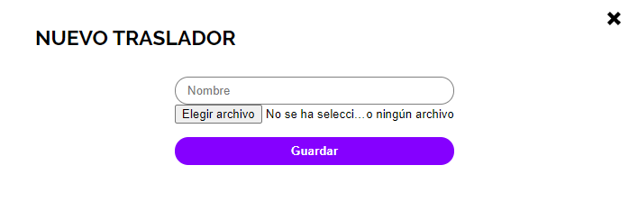

# **¿Qué es Celia 360?** 
El Celia 360, o más conocido como Celia Tour, es una aplicación web creada por el alumnado del 2º curso del Ciclo Formativo de Desarrollo de Aplicaciones Web (DAW) del I.E.S Celia Viñas de Almería, durante el año académico 2019/2020. 
Este trabajo fue realizado con la ayuda y supervisión de los siguientes profesores: 

* Félix Expósito López
* [Alfredo Moreno Vozmediano](https://github.com/avozme)
* Manuel Cristóbal Piñero Mendoza

Fue desarrollado por los siguientes alumnos: 

*  &nbsp; [Jose Francisco Bousfanj Muñoz](https://github.com/Jose-bousfanj-95)
*  &nbsp; [Alejandro Clares Muñoz ](https://github.com/AlejandroClares)
*  &nbsp;[Rosendo De Quero Granados ](https://github.com/erredege)
*  &nbsp;[María del Mar Fernández Bonillo](https://github.com/mmarbonillo)
*  &nbsp;[Ángel Salas Calvo](https://github.com/angelsalascalvo)
*  &nbsp;[Carmen María Soriano Tortosa](https://github.com/7-carmen)

Además, obtuvimos ayuda y colaboración de las siguientes personas: 

* Antonio Barrera Funes
* María del Carmen Cuadrado Sánchez
* María Belén Garzón
* Trinidad Gómez Ruiz
* María José Hernández Meca
* José Luis Hurtado
* Carmen Menéndez Suárez
* Juan González Parra
* Salvador Prieto Pérez
* Luis Serrano Cortés
* Manuela Soriano Sánchez

Esta aplicación fue diseñada para crear recorridos virtuales a través de fotografías panorámicas (Imágenes 360º). 

Nuestra aplicación permite definir las zonas en las que se basará el recorrido virtual, y dentro de cada zona asignar las escenas necesarias a través de puntos situadas en el mapa. A través de estos puntos en el mapa podemos conectar unas escenas con otras para crear el recorrido final. También nos permite crear puntos de interés (hotspots) en cualquier escena, permitiendo así al usuario interactuar con el recorrido. Más adelante veremos más en profundidad que son los hotspots y que tipo existen. 
En definitiva, lo único que necesitamos para poder montar nuestro Tour Virtual a través de nuestra aplicación web es simplemente, imágenes con los mapas de la estancia en la que vamos a hacer el recorrido, imágenes 360 de las estancias del recorrido y en caso de querer meter información adicional necesitaremos imágenes, audios o videos para los hotspot de la información adicional. 

# **Indice:**

1. [Guia de Instalación](#id1)
2. [Primeros pasos](#id2)  
    2.1 [Visita Virtual](#id3)  
    2.2 [Panel de Administración](#id4)
3. [Creando nuestro Tour Virtual](#id5)  
    3.1 [Configurar nuestro Tour](#id6)  
    3.2 [Subir Mapas](#id7)  
    3.3 [Crear Escenas](#id8)  
    3.4 [Subir Escenas Secundarias](#id9)  
    3.5 [Recursos](#id10)  
    3.6 [Galerías de Imágenes](#id11)  
    3.7 [Modelos 3D](#id20) 
    3.8 [Trasladores](#id12)  
    3.9 [Añadir Hotspots](#id13)  
    3.10 [Añadir Visitas Guiadas](#id14)  
    3.11 [Añadir Puntos Destacados](#id15)  
    3.12 [Administrar Usuarios](#id16)  
    3.13 [Crear Escapes Room Virtuales](#id17)  
    3.14 [Realizar Copias de Seguridad](#id18)

# **Guía de instalación:**

La instalación de Celia360 implica el despliegue de la aplicación web en un servidor. Este proceso puede entrañar cierta dificultad si usted no está familiarizado con ello, por lo que puede requerir la colaboración de un administrador de sistemas para completarlo con éxito.

Los requerimientos de la aplicación son:

* Un servidor web son soporte para PHP 5.5 o superior. Se recomienda PHP 7.x
* Un servidor MySQL 5.5 o MariaDB 10 o superior.
* Una conexión FTP con su servidor o alguna otra forma para acceder remotamente a los archivos de su servidor.

Los pasos generales para la instalación son los siguientes:

1. Copie el código fuente de la aplicación en un directorio de su servidor accesible vía web. Puede obtener la última versión del código fuente del repositorio de [GitHub.](https://github.com/mmarbonillo/celia-tour)
2. Cree una base de datos en su servidor MySQL o MariaDB. Recuerde las credenciales de esta base de datos (nombre de la base de datos, usuario y contraseña). Su usuario debe tener privilegios suficientes para escribir y leer en esa base de datos.
3. Cambie el nombre del archivo *example.env* que encontrará en la raíz del directorio por *.env*
4. Cambie el tamaño de memoria del servidor por 1GB (esto debe ser cambiado desde el archivo de configuración del servidor llamado *php.ini*)
5. Accede a través de la URL de tu servidor al recurso */install* (Ejemplo: miservidor.com/install)
6. Al entrar encontrará a siguiente vista, siga los pasos y rellene los campos que se especifican: 

      Tenga en cuenta que el nombre de la base de datos junto con el usuario será el mismo que creo previamente. Apunte  
    y guarde el usuario y contraseña puesto en el área del Usuario Administrador pues con ella podrá acceder después al  
    panel de administración de la aplicación. 

7. Una vez introducidos todos los datos, pulse el botón crear. 
8. Si todo era correcto y la instalación ha ido bien aparecerá una pestaña avisándolo de que la aplicación fue instalada correctamente con un botón para poder acceder al login:

9. Introduzca el usuario y contraseña del administrador que decidió anteriormente para acceder a su panel de control y empiece a disfrutar de su aplicación.

# **Primeros pasos:** 

Una vez instalada nuestra aplicación podremos usarla desde dos perspectivas diferentes: 

1. **Visita virtual:**  Esta es la parte que usara los visitantes de nuestra aplicación, proporciona acceso a los tres modos de las visitas que hemos creado, la visita libre, la visita guiada y los puntos destacados. 
2. **Panel del administración:** Esta parte de la aplicación solo puede ser vista por los usuarios administradores y nos permitirá configurar y crear nuestro tour virtual a partir de las distintas opciones de su menú. 

Como hemos mencionado anteriormente nuestra aplicación final contará con tres modos diferentes de acceso: 

* **Visita libre:** Permite al usuario moverse por el tour virtual con libertad 
* **Visita guiada:** Hace un recorrido por las parte más relevantes del tour virtual, y a su vez va dando una explicación del recorrido que se está llevando a cabo a través de audios. 
* **Puntos destacados:** Muestra una selección de los puntos más importantes del recorrido y nos permite acceder directamente a las escenas que lo componen. 

## **Visita Virtual:** 

Como podemos observar en la foto en la página principal tenemos los botones para acceder a los diferentes modos de la aplicación, además de las páginas de créditos, aviso legal y política de cookies en la parte inferior derecha. 
También será posible agregar la opción de que en esa misma esquina aparezca el botón de *Historia* que nos permitirá escribir un resumen de la historia del recorrido que vamos a ver a continuación. 

## **Panel de administración:** 

Como podemos observar el panel de administración se compone de 9 módulos que nos permitirán configurar y crear nuestro tour virtual. Estos apartados serán explicados más detalladamente más adelante pero antes de empezar a configurarlo le aconsejamos que previamente realice las siguientes funciones: 

1. Haga planos digitalizados y detallados del lugar que pretende virtualizar
2. Sobre un plano indicar en que puntos de las estancia va a realizar las imágenes 360.
3. Realice las imágenes 360 y en el plano asígnele un nombre representativo. 
4. Si quiere introducir datos alternativos prepare las imágenes, videos, audios o documentos que desee incorporarle. 

Una vez que tenga todo eso, es hora de empezar a preparar nuestro Tour Virtual. 

# **Creando nuestro Tour Virtual:**

Ahora vamos a ver los pasos necesarios para crear nuestro tour virtual paso a paso y explicando cada uno de los módulos del panel de administración.

## **Configurar nuestro Tour:** 

Lo primero que debemos de hacer es configurar nuestra aplicación, para ello nos vamos a ir al apartado de *opciones* del menú lateral. Al abrir se nos mostrará una pantalla con los siguientes módulos: 

1. **Meta titulo:** Permite poner palabras que se incrustarán en nuestro código para poder mostrar las descripciones en las búsquedas realizadas en Google. 
2. **Meta descripción:** Permite poner palabras que se incrustarán en nuestro código para poder mostrar las descripciones en las búsquedas realizadas en Google. 
3. **Imagen de icono:** Permite selecciones la imagen de icono que se nos mostrará en la pestaña del navegador. 
4. **Titulo de la web:** Permite configurar el titulo de nuestra web. 
5. **Tipo de fuente:** Nos permite elegir entre diferentes tipos de letra la que más se adecue a la temática de nuestro Tour Virtual. 
6. **Color de fuente:** Nos permite elegir el color de la letra. 
7. **Mostrar botón "Historia":** Permite seleccionar si tendremos o no activo un link a una página que resuma la historia del lugar de nuestro Tour. 
8. **Seleccionar Ascensor o Mapa:** Nos permite seleccionar el tipo de translador que usará nuestra aplicación, para ello debe saber lo siguiente:  
    1. **Ascensor:** Pensado para tour que estén basados en edificios, se configura para poder saltar de planta en planta
    2. **Mapa:** Pensados para tour más extensos, como podría ser por ejemplo un tour por diferentes pueblos, cada pueblo tendría un translador para poder cambiar entre ellos.
9. **Créditos adicionales a la documentación:** Aquí puede añadir personas que han contribuido en su tour virtual, añada los nombres de las personas separados con un punto y coma (Ej.: María García, Eduardo Pérez)
10. **Imagen de portada:** La imagen de portada puede ser configurada de dos maneras:  
    1. **Imagen estática:** Permite seleccionar la imagen que se desea mostrar en la página de inicio de nuestra web. 
    2. **Imagen panorámica:** Permite seleccionar una escena 360 para que sea la portada de nuestra web. Esta escena se irá moviendo, por lo que la portada será dinámica. 
11. **Propietario legal de la web:** En este apartado puede escribir la política de privacidad de su sitio web. 
12. **Texto visita libre:** En este apartado puede poner el texto que quiere que se vea cuando le gente pase el ratón por encima del botón de *Visita libre*. 
13. **Texto visita guiada:** En este apartado puede poner el texto que quiere que se vea cuando le gente pase el ratón por encima del botón de *Visita guiada*. 
14. **Texto puntos destacados:** Em este apartado puede poner el texto que quiere que se vea cuando le gente pase el ratón por encima del botón de *Puntos destacados*.
15. **Texto panel Historia:** Solo aparecerá en caso de que el botón Historia este activado. Em este apartado puede poner el texto que quiere que se vea cuando le gente pulse el botón de *Historia*.  
16. **EscapeRoom:** Este botón nos permitirá activar o desactivar la opción para crear juegos de escape virtuales. Cuando este botón este activo, en el menú del lateral izquierdo nos saldrá un módulo con el mismo nombre que nos permitirá configurar los juegos. En casa de estar desactivado ese módulo no aparecerá en el menú. Más adelante explicaremos el funcionamiento completo del módulo EscapeRoom. 

# 
## **Subir los mapas:** 

Lo primero que debemos hacer es subir los mapas de las zonas que vamos a virtualizar, para ello en el panel de administración nos vamos a ir a la sección de zonas  
En la esquina derecha superior podrá observar un icono para introducir una nueva zona

Pinche sobre el icono para crear su primera zona, en primer lugar, elija el nombre deseado para la zona, por ejemplo *Primera Planta* y seleccione la imagen del mapa de esa planta, después pulse el botón de "Añadir"

Una vez añadida podrás ver esa nueva zona que hemos añadido y encontraras los botones para editarla, borrar la zona o moverla de posición

* **Botón Editar:** Permite al acceder a él cambiar el nombre o el archivo de la imagen referenciada, además dentro de él permite agregar nuevas escenas al mapa, borrar escenas ya creadas o modificarlas. En caso de tener escenas ya creadas también permitirá crear escenas secundarias. Más adelante explicaremos como se agregan y crean las escenas y las escenas secundarias. 

* **Eliminar:** Este botón nos permite eliminar la zona correspondiente. 

* **Flechas de posición:** Estas flechas nos permite configurar la posición en la que se encuentra nuestra zona, estas posiciones nos sirven después para los transladores. 

# 
## **Crear escenas:** 

Como hemos dicho anteriormente, para poder crear una escena deberemos entrar en el editar de las zonas. 
Una vez dentro de esta pestaña veremos el mapa de la zona que hemos seleccionado. 
Para poder añadir un nueva escena haremos clic sobre el punto del mapa al que deseemos añadirle la escena, al clicar veremos que se nos abre un formulario en la parte derecha de la pantalla para añadir la información necesaria de la escena: 

Introduciremos el nombre de la escena junto con su imagen 360. 

Como podemos observar, en el formulario se encuentra un campo que se puede seleccionar llamado *Escena principal*, seleccionaremos este campo en caso de que la escena que estemos introduciendo sea la que queremos que se vea la primera en nuestra visita libre, solo podrá existir una escena principal en todo el Tour. Si no selecciona ninguna escena, por defecto se quedará como escena principal la primera escena que introdujera en el tour virtual.

Repetiremos este proceso tantas veces como escenas necesitemos subir a nuestro recorrido virtual. 

Una vez que tengamos creadas las escenas deberemos saber cómo modificarlas o borrarlas, para ello pincharemos sobre el punto de la escena que deseamos borrar o modificar y se nos abrirá información sobre la escena seleccionada. 

Al seleccionar la escena veremos: 

* El título de la escena 
* Una previsualización de la escena seleccionada 
* Si es o no *Escena principal*
    * Recuerda que solo puede existir una escena principal
* Un botón para poder mover el punto de la escena 
* Un botón para poder eliminar la escena 
* Un botón para poder añadir *Hotspots* 
    * Los hotspots serán explicados más adelante, además veremos cómo se añaden editan o eliminan
* Un botón para guardar los cambios
* Un botón para añadir *Escenas Secundarias*
    * Este apartado también será explicado más adelante. 

Para **eliminarlas** simplemente pincharemos sobre el botón de eliminar, para **modificar** cambiaremos lo deseado (el nombre, el archivo de la imagen o ambas cosas) y pulsamos sobre el botón guardar. 
Para **cambiar el punto** pinchamos sobre el botón de mover punto y pinchamos sobre el mapa en el nuevo lugar donde queramos colocar la escena, después le damos a *aceptar*. 

# 
## **Crear escenas secundarias:** 

Lo primero que debemos saber es ¿Que es una escena secundaria?  
Una escena secundaria es una imagen 360 adicional a la imagen principal de una escena, con el objetivo de así poder tener diferentes vistas según el momento de la misma escena. 

Por ejemplo, en un museo, con esta opción podríamos tener escenas secundarias con todas las exposiciones que se han ido realizando y de esta manera no perder las exposiciones nunca. 

Para poder añadir una escena secundaria, como hemos dicho anteriormente debemos tener previamente la escena normal ya subida, y seleccionada para que nos salga la información de la escena principal.  
Una vez seleccionada la escena principal, debajo del menú para editarla nos saldrá el botón para añadir nueva escena secundaria, pulsaremos sobre él y se nos abrirá el formulario para añadir nueva escena secundaria: 

La información que necesitaremos para añadir la escena secundaria será:  
1. El nombre de la escena secundaria (Ejemplo: Exposición Almería en el siglo XX)
2. La fecha en la que se realizó la exposición o las imágenes alternativas 
3. La imagen 360  

Por último, le daremos a guardar y ya tendremos implementada nuestra escena secundaria.

Cuando tengamos alguna escena secundaria asociada a una escena podremos verla en la parte inferior del mapa al seleccionar la escena.

Desde este punto podremos modificarlas, eliminarlas o añadirle hotspots como si de una escena principal se tratase.  
En el caso de las escenas secundarías para modificarlas necesitaremos darle al botón de modificar para que se nos abra el formulario necesario para modificarlas. 

*Debes tener en cuenta que no se podrán borrar escenas que tengan asociadas escenas secundarias, para poder borrarlas primero deveras de borrar las escenas secundarias asociadas.*

# 
## **Recursos:** 

Lo primero que tenemos que saber lo de los recursos es que existen recursos de 5 tipos:  
* Imagen 
* Video 
* Audio 
* Documento
* Modelos 3D

Para administrar los *recursos* debemos pinchar sobre el botón de Recursos del menú lateral.  
Cuando abrimos la pestaña nos encontramos con la siguiente vista, en la que podremos encontrar 4 objetos importantes: 

1. **Filtros:** Este filtro nos permite ver solo los recursos que pertenezca un tipo determinado
2. **Buscador:** El buscador nos permite buscar en todos los recursos por su nombre o descripción
3. **Subir video:** Los videos que se usan para nuestra aplicación son videos sacados de Vimeo, para poder subir un video pulsaremos ese botón para que se nos abra el formulario de subida. Para poder subir un video solo tendemos que asignarle un nombre y poner la URL del video deseado.  
4. **Subir recursos:** Nos permite subir el resto de recursos, en este apartado nos pararemos un poco más.  
Cuando pinchemos sobre este icono se nos desplegará lo siguiente, para poder subir archivos sólo tendremos que arrastrarlos encima del recuadro, o pinchar encima del cuadro para seleccionarlos. 

Cuando subamos archivos se nos crearan miniaturas, para poder editar o eliminar cualquier recurso deberemos pinchar sobre la miniatura del recurso deseado.  
Al pinchar sobre el recurso se nos abrirá una ventana que nos mostrará el recurso (la imagen, el reproductor en caso de video o audio o el contenido el archivo PDF) junto con la información del recurso. 

Como ha podido observar en la imagen, en los autiods es posible añadirles subtitulos. Para poder añadirlos pincharemos sobre el botón Añadir subtitulos que se encuentra dentro de la ventana de *Editar*, esto nos permitirá escoger el archivo de los subtitulos.  
Para crear archivos de subtitulos puede hacerlo en el siguiente [enlace]( https://www.happyscribe.co)  
El archivo que vayas a subir tendrá que tener su nombre formado de la siguiente manera: **nombre.idioma.vtt** (Ejemplo: audio3.español.vtt)

# 
## **Galerias de Imagenes:** 

Para abrir la Galerías pincharemos en el menú lateral la opción de *Galería*, como en la vista de los recursos encontraremos un icono en la parte superior derecha para añadir nueva Galería.  
Pulse sobre este botón y cree su primera Galería, como observará en el formulario solo necesita ponerle un nombre y una descripción del contenido de la galería. 

Una vez creada nuestra galería la vista quedara con el siguiente aspecto y encontraremos los siguientes botones de control: 

1. **Editar:** Nos permite editar los valores de la galería, es decir, su nombre y descripción 
2. **Recuersos:** Nos permiten seleccionar las imágenes que deseamos que compongan esa galería. Después veremos esa vista y los botones de control que contienen. 
3. **Eliminar:** Elimina la galería seleccionada. En caso de que la galería contenga archivos asociados nos saldrá una ventana alertándonos del peligro de borrarla.  En caso de querer borrarla igualmente, al pulsar sobre el aceptar se borrará tanto la galería como todas las relaciones con las imágenes que tuviera asociadas.

Como hemos dicho anteriormente cuando pinchemos sobre el botón recursos se nos abrirá la siguiente página: 

1. **Buscador:** Permite buscar imágenes por su nombre o descripción.
2. **Guardar:** Guarda las imágenes seleccionadas y te devuelve a la vista principal de galerías. 
3. **Seleccionar imagen:** Haz clic sobre el seleccionador de la imágenes que deseas que pertenezcan a la galería. 

# 
## **Modelos 3D:** 

En el Celia Tour podemos añadir a nuestro recorrido virtual una serie de recursos como imágenes, audios…
Ahora también es posible añadir modelos en tres dimensiones. Antes de subir un nuevo modelo a nuestro tour, tenemos que tener un par de cosas en cuenta:
1. La escala del modelo
2. Su rotación
3. El tipo de archivo
4. Sus texturas

En primer lugar, el código usado para mostrar los modelados en 3D está implementado para que los modelos se muestren con una rotación y escala determinada.
Puede ocurrir que si subimos **un modelo con una rotación o escala incorrecta no se visualice adecuadamente o directamente ni se visualice**
(imaginemos que subimos un modelo con una escala demasiado pequeña, el modelo no se visualizaría en nuestra aplicación debido a ello).

Por ello es necesario que los modelos incorporados a Celia Tour, sean probados previamente en un programa de modelado 3D como, por ejemplo, Blender.
Desde ahí podemos generar nuestro modelo desde cero o realizar los cambios oportunos a un modelo ya generado previamente por otra persona.

Una vez tengamos generado nuestro modelo es necesario cargarle las texturas y cuando esté listo importarlo con la extensión `.glb`.
**Esto es muy importante**, puesto que nuestra aplicación solo permite incorporar modelos de este tipo. Otros formatos muy usados en modelado 3D es el formato `.fbx`,
perteneciente a **Facebook**. En caso de tener un modelo con esta extensión, podemos ir a Blender y exportar nuestro modelo al formato que deseemos (en este caso `.glb/gltf`).

Accedemos al menú superior izquierdo en `Archivo/Exportar/glTF` y guardamos en nuestro sistema nuestro modelo ya sí con la extensión deseada.

[AÑADIR ESCALA]

Una vez tenemos diseñado nuestro modelo 3D y lo hemos guardado con la extensión `.glb`, desde nuestro Celia Tour debemos seguir los siguientes pasos. 
Accedemos a nuestro panel de administrador y pinchamos sobre la opción de **Recursos**.
Una vez ahí nos aparecerán todos los recursos subidos a nuestra aplicación.
Nos situamos en el menú superior y **pinchamos sobre el botón de subida de archivos**:

Nos aparecerá un recuadro desde donde podremos arrastrar nuestro archivo `.glb y soltarlo`:

Una vez lo arrastramos nos indicará que se ha subido correctamente y nos aparecerá una previsualización del archivo ya añadido a recursos:

Una vez añadido el recurso debemos irnos a **Zonas**:

Desde ahí, seleccionamos la zona de nuestro mapeado donde queremos añadir nuestro modelo 3D.
Pinchamos en editar y, a continuación, en el punto concreto del mapa donde queremos añadir el modelo. Nos aparecerá un menú lateral donde pincharemos en Editar Hotspots:

Entonces nos aparecerá la siguiente ventana, desde donde podremos añadir un nuevo hotspot:

Seleccionamos el tipo de hotspot que queremos añadir, en nuestro caso **Modelo 3D**:

Hacemos **doble click** sobre el lugar donde queremos colocar nuestro modelo:

Una vez colocado nos aparecerá el siguiente icono:

Pinchamos sobre él y nos aparecerá los modelos ya cargados previamente desde **Recursos**. En nuestro caso habíamos subido **un modelo 3D de nuestro instituto**
y nos aparece para poder ser asignado al hotspot:

Hecho esto ya nos debería de aparecer nuestro modelo 3D tanto en la Visita Libre, la Visita Guiada como en los Puntos Destacados.
Si nos vamos a nuestra Visita Libre, por ejemplo, y vamos al lugar donde colocamos **nuestro botón ya aparecerá**:

Si pinchamos sobre el botón, nos desplegará una nueva ventana donde se nos mostrará **la previsualización de nuestro Modelo en 3D**:

#
## **Trasladores:** 

Como dijimos en el apartado de configuración existen transladores de dos tipos:  
1. **Ascensor:** Pensado para tour que estén basados en edificios, se configura para poder saltar de planta en planta
2. **Mapa:** Pensados para tour más extensos, como podría ser por ejemplo un tour por diferentes pueblos, cada pueblo tendría un translador para poder cambiar entre ellos.

La vista principal no cambiará tengas el tipo de translador que tengas, como en el resto de vistas solo tendrás que darle al botón de añadir nuevo sitiado en la parte superior derecha. 

En caso de que en las opciones tengas seleccionado el translador *Ascensor* se te abrirá el siguiente formulario:

Una vez creado se nos verá la vista de la siguiente manera: 

Esta vista sigue siendo igual te encuentres en el tipo de translador que te encuentres

Encontraremos tres botones:  
1. **Editar:** Permite cambiar el nombre del translador
2. **Escena:** Cuando pulsemos este botón se nos abrirá una página para poder seleccionar las escenas que se encontraran dentro de este ascensor. Cuando le demos al botón de añadir nueva escena se nos abrirá una ventana como la siguiente para seleccionar el punto de la escena deseado
3. **El botón eliminar:** Elimina el translador, un translador no puede ser eliminado si contiene escenas asociadas. 

Una vez que seleccionemos el punto y le demos a guardar el aspecto de la vista será el siguiente: 

1. **Titulo de la escena**
2. **Nombre de la zona a la que pertenece esa escena**
3. **Previsualizar:** Al pinchar sobre el botón podremos previsualizar la escena que hemos escogido 
4. **Eliminar** 

En caso de que en las opciones tengas seleccionado el translador *Mapa* en vez del *Ascensor* el proceso será algo diferente, y lo que se te abrirá al pinchar en nuevo ascensor será el siguiente formulario:

La administración de esta vista será similar a la del translador anterior con la única diferencia de que en vez de seleccionar la zona a la que pertenece la escena de esa translador se nos mostrará la siguiente vista: 

Esta vista será la imagen que subimos anteriormente al crear el translador.   
Para crear una escena pincharemos sobre la zona del mapa deseada y le daremos al botón de seleccionar escena que nos abrirá una ventana modal para seleccionar la escena deseada como hicimos en el transladores de tipo ascensor.  
Cuando seleccionamos la escena, se nos mostrará una previsualización y nos saldrá el botón de guardar. 

Para editar cualquier escena simplemente pincharemos sobre el punto de la escena deseada y a la derecha se nos abrirá el panel para borrar, editar o cambiar la posición de la escena. 

# 
## **Añadir Hotspots:** 

Lo primero que vamos a recordar es que para administrar los hotspots debemos irnos a Zonas, seleccionar la zona deseada, y pinchar sobre la escena a la que queremos añadir hotspots.  
Cuando tengamos la escena seleccionada pincharemos sobre el botón del menú lateral derecho llamado *"Editar Hotspots"* y se nos abrirá la siguiente ventana: 

1. **Nombre de la escena:** Nos proporciona el nombre de la escena seleccionada para así saber a que escena le estamos añadiendo los Hotspots 
2. **Nuevo hotspot:** Al pulsar este botón se nos abrirá un menú con todos los tipos de los hotspot, allí seleccionaremos el hotspot deseado que queramos configurar. 
3. **Establecer vista:** Esta opción nos permite cambiar la perspectiva con la que por defecto se ve la foto. Para configurarlo simplemente mueven la imagen 360 hasta dejarla como más te guste y pulse el botón *Establecer vista* para guardar la posición. 
4. **Volver a zona:** Nos devuelve al mapa de la zona que teníamos seleccionada. 

### **Tipos de hotspot:**
1. **Texto:** Cuando clickemos sobre él se nos mostrará un texto relacionado con la estancia o alguno de sus componentes. 
2. **Salto:** Los hotspot de salto nos permiten movernos a través de las escenas 360 para dar la sensación de movimiento dentro del tour. 

3. **Video:** Nos permite asignar un video que esté relacionado con la estancia o alguno de sus componentes. 
4. **Audio:** Nos permite añadir un audio que esté relacionado con la estancia o alguno de sus componentes. 
5. **Galería de imágenes:** Nos permite añadir una galería de imágenes que  esté relacionada con la estancia o alguno de sus componentes.
6. **Ascensor:** Nos permite cambiar entre las diferentes zonas dentro del recorrido virtual.

El aspecto que tendrán en nuestro tour virtual será el siguiente: 

Cuando cree un nuevo hotspot de tipo salto vera que puede marcar la siguiente opción:

Seleccione esta opción si no quiere que este hotspot de tipo salto aparezca en el recorrido de los puntos destacados. Como verá más adelante los puntos destacados son "mini tour virtuales" de estancias importantes del tour. Por ejemplo, un laboratorio o la biblioteca. Por eso puedes seleccionar que hotspots de salto quiere permitir usar al usuario cuando este dentro de ese punto destacado. En caso de no ser un punto destacado no deberá darle ningún tipo de importancia a este mensaje. 

# 
## **Añadir Visitas guiadas:** 

Para crear una nueva visita guiada es necesario que previamente estén todas las escenas subidas junto con los recursos de audio necesarios. Una vez tengamos los componentes listos nos iremos a la venta de *Visitas guiadas* del menú lateral. Como en el resto de las vistas encontraremos en la parte superior derecha un botón de añadir nueva visita guiada, pinche sobre él y rellene los campos con los datos: 

Los datos necesarios son, un nombre, una descripción de lo que veremos en la visita guiada y una imagen representativa de la visita. 
Una vez creada la visita guiada la vista se nos quedará de la siguiente manera, como puedes observar es una vista muy parecida a la vista anteriormente en sitios como las galerías. 

1. **Editar:** Nos permite editar los valores de la visita guiada, es decir, su nombre, descripción e imagen.
2. **Escenas:** Nos permiten seleccionar las escenas que deseamos que compongan esa visita guiada junto con sus audios. 
3. **Eliminar:** Elimina la visita guiada seleccionada. Para poder borrar una visita guiada es necesario que dicha visita no contenga ninguna escena asociado, en caso contrario saltará un error y no nos dejará borrar la visita guiada. 

### **Añadir escenas:**

Para añadir nuevas escenas a las visitas guiadas pincharemos sobre el botón de *Escenas* de la vista. Una vez dentro de la vista veremos en la parte superior el botón de añadir nueva escena, junto con el botón de guardar posiciones, este botón nos permitirá guardar el orden por el que se verán las escenas y se reproducirán su audio asociado. Pinche sobre el botón de añadir nueva escena y aparecerá una ventana modal con las escenas, seleccione la que desee y después aparecerán los audios para que seleccione el audio que desee, por último guarde y verá la siguiente tabla: 

La información que verás en esta vista será:  
1. El nombre de la escena que seleccionaste 
2. Un reproductor para poder escuchar el audio elegido 
3. El botón de eliminar para poder eliminar la escena. 

En caso de haberte equivocado con el orden al créalas, no te preocupes, puedes pinchar sobre la escena que deseas mover de posición y arrastrarla hasta la posición deseada. Por último, pulse sobre el botón de guardar posiciones para guardar el orden que has creado. 

# 
## **Añadir Puntos destacados:** 

Un punto destacado es un "mini tour virtual" de una estancia importante del tour. Este punto destacado nos dejará movernos para la estancia seleccionada para así poder acceder directamente a los sitios más importantes de nuestro Tour.  
Para añadir un nuevo punto destacado nos iremos al módulo de *Destacados* del menú lateral, como en el resto de las vistas veremos en la parte superior derecha un botón para añadir nuevo punto destacado. Cuando pinchemos sobre é se nos abrirá el formulario para crearlo con el siguiente aspecto: 

Será necesario añadir un nombre, elegir una foto y añadir la escena con la que se relaciona el punto destacado. 

Como en el resto de vistas el botón eliminar nos permitirá eliminar el punto destacado y el botón editar nos permitirá cambiar los valores del punto destacado abriendo una ventana modal para poder realizar los cambios. 

# **Administrar usuarios:** 

Para poder añadir nuevos usuarios al sistema, deberemos irnos al panel de administración, al módulo de usuarios del menú lateral.  
Dentro encontraremos información se los usuarios ya creados, encontrará el suyo por defecto allí. 
Para añadir un nuevo usuario pinche sobre el botón de añadir nuevo usuario situado en la parte superior derecha de la pantalla.  
Añada los datos que se le piden en el siguiente formulario para crear el nuevo usuario

Una vez añadido verás el nuevo usuario creado en la tabla de usuarios. 

Para poder cambiar el nombre, correo o contraseña del usuario usaremos el botón de *Modificar* que nos abrirá una ventana modal para modificar los datos. En caso de querer eliminar el usuario usaremos el botón *Eliminar*

# **Crear EscapeRoom Virtuales:** 

Una vez activada en opciones los EscapeRoom los configuraremos pulsando sobre el botón EscapeRoom del menú lateral izquierdo. Una vez dentro la página de inicio será idéntica a la del resto, con el nombre del módulo y un símbolo de añadir nuevo EscapeRoom en la parte superior derecha. 
Una vez pinchemos sobre ella nos aparecerá el siguiente menú para crear el nuevo EscapeRoom. Recuerda que puedes crear tantos EscapeRoom como desees. 

Los datos necesarios para crear el nuevo EscapeRoom serán:  
1. **Nombre:** Nombre que recibirá el EscapeRoom
2. **Descripción:** Una descripción que nos explique sobre la temática o desarrollo del juego. 
3. **Dificultad:** La dificultad ira de menor a mayor, significando un punto que el juego es fácil y 5 que el juego es muy difícil. 

Una vez creado el juego la vista tendrá la siguiente apariencia: 

Como podemos observar se verán los datos introducidos anteriormente y tres botones. 

1. **Editar:** Nos permitirá editar los datos que se introducen al crear el EscapeRoom, es decir, nombre, descripción y dificultad.
2. **Configurar:** Nos permitirá configurar el juego, este botón será desarrollado más adelante. 
3. **Eliminar:** Nos permite eliminar el EscapeRoom completo. 
4. **Activo o Inactivo:** Esta opción nos permite modificar si el juego será visto por los usuarios, de esta forma podremos crear nuestro juego sin preocuparnos de que los usuarios lo ven a medias. Pondremos la opción Activo si queremos que los usuarios puedan verlo, inactivo en el caso contrario. 

Para poder configurar el EscapeRoom como hemos dicho anteriormente presionaremos sobre el botón *configurar*. Una vez dentro encontraremos el siguiente menú: 

Como podemos observar, en el menú superior encontraremos cinco pestañas para poder configurar nuestro EscapeRoom:

1. **Opciones:** En este apartado podremos configurar los siguientes apartados: 
    - **Audio ambiental:** Será el sonido que se escuche de fondo durante todo el juego, exceptuando cuando se lean preguntas o pistas. 
    - **Escena Inicial:** Será la escena en la que comience el juego. Por defecto inicia en la misma escena que la visita virtual, pero puede ser modificada por la escena deseada. 
    - **Historia:** Será la primera pista que se vea en el EscapeRoom, generalmente cuenta un poco por que estamos encerrados y da la pista inicial. 
    - **Audio de la historia:** Nos permité añadir un audio con el texto de la historia, para que el jugador no solo tenga el texto, sino que también lo escuche. 

Pulsando al botón superior derecho podremos editar todas estas opciones y configurar a nuestro gusto. 

2. **Escenas:** En este apartado podremos añadir los hotspots tipo pista o tipo pregunta para el juego. Estos hotspots lo que harán serán que cuando el usuario pinche sobre el objeto se le abrirá o bien un cuadro de texto con la pista oportuna, o con un panel para poder contestar la pregunta correspondiente.  
Para configurar los hotspots seguiremos los siguientes pasos: 
    - Seleccionamos el punto de las escenas deseado
    - Pulsaremos el botón de **modificar escena** que encontraremos en la parte derecha 
    - Una vez dentro encontraremos la siguiente vista: 
    
    - Para introducir cualquiera de los dos, pincharemos sobre un punto dos veces y arrastraremos para crear el rectángulo o cuadrado tan grande como el objeto lo necesite. 
    - Después pincharemos sobre el cuadro creado dentro de la imagen y seleccionaremos la pista o pregunta correspondiente
    -Igual que en los otros hotspots estos pueden ser editados, movidos de sitio o eliminados.

3. **Preguntas:** En el apartado de preguntas se podrán añadir las preguntas que nos permitirán desbloquear pistas o llaves. Las preguntas contendrán la siguiente información:

    - **Pregunta:** Será el texto de la pregunta que vamos a realizar. 
    - **Respuesta:** Texto de la respuesta 
    - **Multimedia:** A las preguntas se le podrán añadir imágenes, videos y audios. 
    - **Se podrán eliminar o editar**

- Para añadir una nueva pregunta pulsaremos en el botón de más de la parte superior derecha, introduciremos los datos necesarios y en caso de querer añadir contenido multimedia seleccionaremos el tipo de contenido y nos saldrá un botón que nos abrirá una modal para seleccionar el recurso deseado, y por último pulsaremos el botón de guardar. 

4. **Llaves:** Las llaves nos permiten tener estancias cerradas, de esta forma el jugador no se puede adelantar a la linea temporal del juego, y el responder preguntas puede tener diferentes objetivos. 
Para crear una nueva llave necesitaremos introducir los siguientes datos: 
    - **Nombre de la llave:** Será el nombre que el usuario verá en la llave al conseguirla en el juego
    - **Pregunta:** Es la pregunta que el usuario debe responder para poder conseguir esa llave. 
    - **Llave final:** Debemos indicar si la llave es la llave final del juego. 
    - **Escenas:** Aquí seleccionaremos las escenas que cierran esta llave. Puede ser más de una escena. Seleccionas todas las que creas necesarias. 
- Como en todos los casos las llaves pueden ser editadas o eliminadas. 

5. **Pistas:** Las pistas nos permiten dar indicaciones al usuario, no tienen por que ser todas útiles para el juego, al igual que en las preguntas pueden tener contenido multimedia, los datos necesarios para crear una nueva pista son: 
    - **Pista:** Será el texto de la pista, se le puede meter texto enriquecido, como saltos de linea, negrita etc. 
    - **Pregunta:** En caso de que la pista sea conseguido por responder una pregunta deberemos de seleccionarla aquí. 
    - **Multimedia:** A las preguntas se le podrán añadir imágenes, videos y audios. 
    - **Se podrán eliminar o editar**

Te recomendamos que antes de introducir todos los datos del Escape Room montes bien toda la historia, juntos con sus pistas y preguntas para que te resulte más fácil la experiencia. 

* **CREANDO UN ESCAPE ROOM DE EJEMPLO**

En primer lugar, en la vista de Escape Room crearemos el nuevo juego, le colocaremos el nombre, la descripción y la dificultad. Por defecto nuestro juego estará en *Inactivo*, por lo que podremos crearlo tranquilamente sin que el usuario sea consciente de nada.  
Una vez creado el juego entraremos en el apartado de *Configuración*, una vez dentro en primer lugar añadiremos en la vista de opciones la primera pista que verá el usuario y escogeremos la escena inicial del juego, por defecto esta escena será la misma que la de la visita libre.  
Recuerda que puedes añadirles un audio para la pista, y otro de fondo que se escuchará durante todo el juego. Una vez tengamos esto configurado pasaremos a la vista de preguntas.  
En esta vista crearemos todas las preguntas que sean necesarias para nuestro juego. Recuerda que es recomendable tener un esquema previo de las pistas, preguntas, y llaves que se irá encontrando el jugador para que te sea más fácil meter los datos.  
Una vez tengas metidas todas las preguntas necesarias haremos lo mismo con las pistas. Introduce todas las pistas que sean necesarias, si tenías el esquema previo hecho te costará muy poco relacionar que pregunta te dio una pista. Recuerda que no todas las pistas tienen por que venir de una pregunta. Por último crea las llaves que el usuario deberá ir encontrando y asocia la llave a la pregunta que tendrán que responder para poder conseguir esa llave.  
Una vez tengas cargados todos estos datos en tu juego, nos iremos a la vista de Escenas, ya solo nos quedará colocar las pistas y las preguntas en los objetos que deseemos.   
Una vez tengas colocadas todas las pistas y preguntas podrás volver a la vista principal de Escape Room y poner tu juego en *Activo* para que todo el mundo pueda jugarlo.  

# **Realizar copias de seguridad:** 

Es importante realizar copias de seguridad periódicamente para así en caso de tener cualquier problema poder recuperar toda nuestra información de forma sencilla.  
Para realizar y restaurar copias de seguridad, desde el panel de administración nos iremos al módulo del menú lateral de *Backup*  

Pincharemos sobre el botón *Descargar copia* para crear y descargar una nueva copia de seguridad, esta copia contendrá la carpeta de todos nuestros recursos, las carpetas con las imágenes 360 de las escenas subidas y un SQL de la base de datos de la aplicación.  
Pincharemos sobre el botón *Subir copia* para restaurar una copia de seguridad que tengamos en nuestro sistema. Al pinchar sobre este botón se nos abrirá un explorador de archivos para seleccionar el SQL que deseamos restaurar.

Antes de cualquiera de los dos procesos se nos abrirá una ventana de confirmación recordando al usuario que las copias de seguridad pueden tardar un cierto tiempo y pidiendo que confirme la operación. 

# 

Llegados a este punto ya tendrá una aplicación completamente montada y lista para ser usada por cualquier usuario que desee ver su tour virtual.
